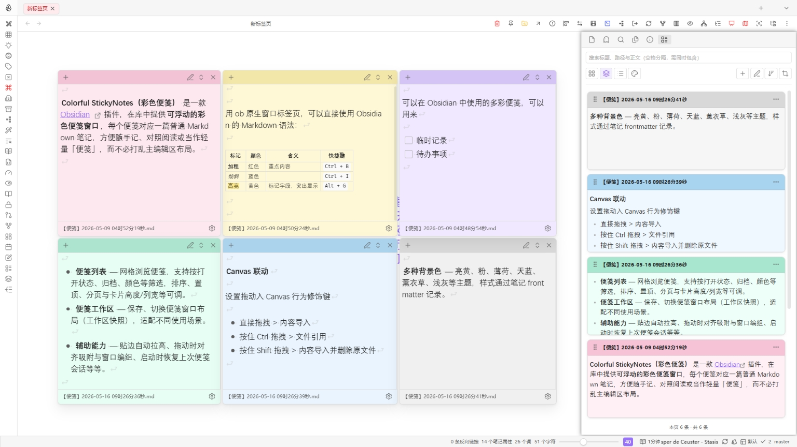

English: [README.md](README.md)

**Colorful StickyNotes（彩色便笺）** 是面向 [Obsidian](https://obsidian.md) 的插件：在库内打开**可拖拽、可叠放的彩色便笺窗口**，每个便笺背后都是一篇普通 Markdown 笔记。默认目录为 `StickyNotes`，可在设置中修改。

### 主要功能

- **浮动便笺窗口** — 小窗口叠在界面上方，内容来自库内笔记（默认目录 `StickyNotes`，可在设置中修改）。
- **多种背景色** — 亮黄、粉、薄荷、天蓝、薰衣草、浅灰等主题，样式通过笔记 frontmatter 记录。
- **便笺列表** — 网格浏览便笺，支持按打开状态、归档、颜色等筛选，排序、置顶、分页与卡片高度/列宽等可调。
- **便笺工作区** — 保存、切换便笺窗口布局（工作区快照），适配不同使用场景。
- **辅助能力** — 贴边自动拉高、拖动时对齐吸附与窗口编组、启动时恢复上次便笺会话、新建文件名模板（支持 Moment 风格与子目录）、可选默认模板笔记等。

### Canvas 联动

在 **便笺列表** 中按住卡片**拖拽手柄**，可将一张或多张便笺拖到 Obsidian **Canvas** 上松手，在落点创建节点；多张时按设置中的间距与「每行最多」排成网格。

拖入 Canvas 时的操作：

- 直接拖拽 > 内容导入
- 按住 **Ctrl** 拖拽 > 文件引用（macOS 为 **⌘**）
- 按住 **Shift** 拖拽 > 内容导入并删除原文件（移入回收站，请谨慎使用）

可选能力在设置 **「Canvas 联动」** 中调整：新建节点默认宽高、拖入后自动贴合高度、节点颜色与便笺颜色同步、拖入后缩放画布以框选新建节点、拖拽时显示按键说明等。

<video controls src="assets/PixPin_2026-05-10_01-32-43.mp4" title="Canvas 联动"></video>

### 安装方法

#### 通过 BRAT 安装（推荐）

1. 在 Obsidian 社区插件市场安装 **BRAT** 插件。
2. 前往 **设置** → **BRAT**。
3. 点击 **Add Beta plugin**（添加测试插件）。
4. 输入本仓库地址：`https://github.com/PandaNocturne/obsidian-colorful-stickynotes`。
5. 点击 **Add Plugin**。
6. 在 **社区插件** 中启用该插件。

#### 手动安装

1. 在 [Releases](https://github.com/PandaNocturne/obsidian-colorful-stickynotes/releases) 页面下载最新的 `main.js`、`manifest.json`、`styles.css`。
2. 在你的库的 `.obsidian/plugins/` 目录下创建一个名为 `colorful-stickynotes` 的文件夹。
3. 将下载的文件放入该文件夹。
4. 重启 Obsidian 并在设置中启用。

### 开发

如果你想自行构建插件：

1. 克隆此仓库。
2. 运行 `npm install` 安装依赖。
3. 运行 `npm run build` 进行编译。

### 致谢

本插件在设计与实现上参考、借鉴了以下社区作品，在此致谢：

- [**obsidian-card-note**](https://github.com/cycsd/obsidian-card-note) — 卡片化笔记与浮层交互方面的思路
- [**obsidian-hover-editor**](https://github.com/nothingislost/obsidian-hover-editor) — 浮动编辑器与窗口行为的实现参考

### 许可

[MIT](LICENSE)
